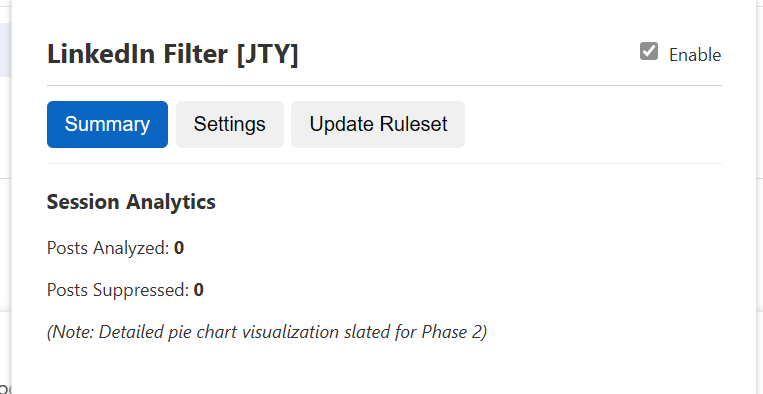
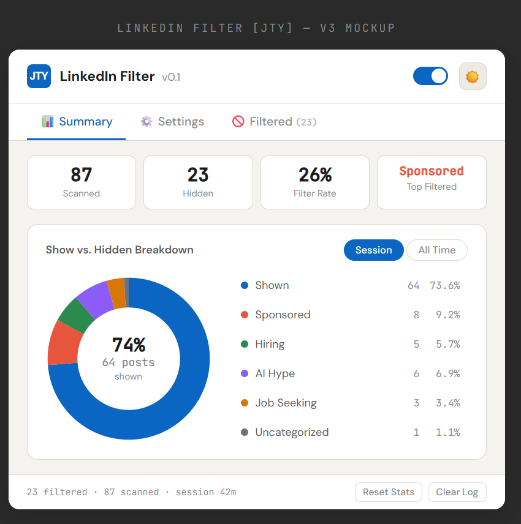

# Project 002 — Chrome Extension: LinkedIn Post Filter (HOLD / PROTOTYPE ONLY)

**Date:** 2026-02-24
**Complexity:** ⭐
**Stack:** Google Gemini 3 Pro, Claude Opus 4.6, Chrome Browser
**Time Spent:** 2 Days 

## 💡 The Idea
For my second LLM vibe coding project, I wanted to stick with Chrome Extensions and address a pain point that I assume most folks looking for a job face: doom scrolling through the LinkedIn feed trying to filter out the sponsored, posts about AI, so that I could just see the posts from hiring managers recruiting. I thought the introduction of a Chrome Extension UI would make this a naturally sensible second project -- Oh was I wrong.
 
## 🧠 What I Learned
### Impression / Vibes:
- I decided to try Google Gemini 3 Pro (as Claude Opus 4.6 had burned through all my session tokens doing something that was a low priority 3 task). 
- My initial impressions of Gemini 3 Pro were good: I gave it my scope, problem, the rough UI and interaction experience, approach, and ways of working. And it followed these prompts and did what I asked, emphasizing the security-focus I was interested in. The conversation was good, like a thoughtful engineer asking follow-up questions about my PRD and sorting out edge cases. It proposed navigation, we suggested tweaks and Gemini iterated. It brought up technical approaches/solutions like the waterfall hierarchy for categorizing posts that made sense and I agreed with. I tried to do some validation, and it seemed fine. Then I asked it about usability and scalability of the ruleset; what happens if the ruleset is updated, would it be retained? It said, yes I can make that so. But immediately after when pressed, it told me: "AHHH just kidding, I can't do that" -- what? so it added useless code? That's not great. But transgression forgiven, just fix it and we'll move on. Anyways, we figured out a workaround and user interaction/flow. Ok, now build. But Gemini couldn't create zip files, and could only give me code snippets which was annoying.
- I realized vibe coding with different LLM models is like working with different engineers, who have different styles and highlight different things. It’s similar to me talking to an engineer through Slack. I thought Gemini 3 and Claude 4.6 were both good models.
- Just FYI, I had started prompting Gemini when hopping on the treadmill doing a Zone 2 heart rate jog, and when I finished vibe coding I realized I had been jogging for 90 minutes!
- When I got back to my desk, I excitedly created the folder structure copy/pasting code to validate functionality and what do I see? Gemini told me a core requirement was "slated for phase 2" <-- when did we discuss this?! That's REALLY BAD. Is Gemini an overpromising, yes-man that requires infeasible levels of handholding and validation?
  
- Anyways, I fired Gemini 3 Pro and went back to trusty Claude Opus. I gave Claude my conversation history from Gemini and Claude said: Yup, you're trying to build a chrome tab memory saver? what? No... so clearly something funny is going on with data ingestion. 
- Claude made a beautiful UI, and told me the code works! Nope. I have it HTML thinking it would be like the View Image project, but wow Linkedin really obfuscates its HTML with random characters strings. 
- Reviewing the HTML, i saw among the sea of randomly generated div tags names like: [role="listitem"] for the post container and [data-testid="expandable-text-box"] for text, but I wasn't going to parse through all randomly generated html and figure out the regex code (+ learned scraping linkedin breaks their terms and conditions). Ah so I decided to stop. But, silver lining: it would be pretty useful if it worked.
  [Link to Prototype of LinkedIn Post Filter Chrome Extension](https://htmlpreview.github.io/?https://github.com/jtnyg/public-vibe-coded/blob/main/002-ChromeExtension-LinkedInFeedFilter%20(Prototype%20Only)/PROTOTYPE-linkedin-filter-mockup-v3.html)
  
 
### Best Practices:
- Again, trust but verify.
- When giving feedback, combine multiple points in a single prompt via bullets.
- Tackle the project step-by-step and vet everything in detail.
- Tell LLM NOT to build until you say so, otherwise you'll get a new build after every prompt burning a ton of tokens.
- Keep an eye on Claude Settings Usage tab to monitor what % of bandwidth is left. 
- Give the AI a PRD for clearer expecations up-front to minimize subsequent back-and-forth.
- Define approach: I’m a Product Manager and you’re a coding/design/communication genius who is concise/helpful and will help me build a chrome extension. I want to analyze this step-by-step with you as a discussion: (1) Explain how the technical details (html tags, next data, etc) work, (2) explain how you would code it, (3) explain what UI/controls should be exposed to the user, (4) possible edge case/errors/risks and (5) show me what the UI might look like so we can iterate. Do not do any code yet, we want to first get the requirements right.
- Define ways of working: Don't build/compile code until I say so; keep code implementation simple; make UI popup larger, with larger text. Have a light/dark mode.
- Just because you give it a summary file to build context, doesn't mean that it knows. You have to be explicit in the prompt- be mindful here. 

### Personal Insights:
- Running out of Claude tokens is like your star analyst going on PTO after a 40 hour work week.

### Technical Limits:
- Gemini can’t export files into a zip; u have to manually copy/paste code into files. Claude can.

## 🏁 Outcome

### What Shipped
- I only got a (very pretty looking) prototype -- would've been great if it worked.
  [Link to Prototype of LinkedIn Post Filter Chrome Extension](https://htmlpreview.github.io/?https://github.com/jtnyg/public-vibe-coded/blob/main/002-ChromeExtension-LinkedInFeedFilter%20(Prototype%20Only)/PROTOTYPE-linkedin-filter-mockup-v3.html)
  

### What's Next
- Try out Claude Code, Workspace, Console/API + Gemini ecosystem.
- Try to use Claude Sonnet so I don't burn all my tokens.
- See if it's feasible to create new chats for "Part 2" to reduce token burn.
- I want to pivot this to something more open (maybe RSS feeds to filter news); I think  Chrome apps are a thing?
- Improve setting PRD/ways of working/approach at first contact. 
- Validate as much as possible; maybe build a lower DEV/SIT environment for more serious builds.
